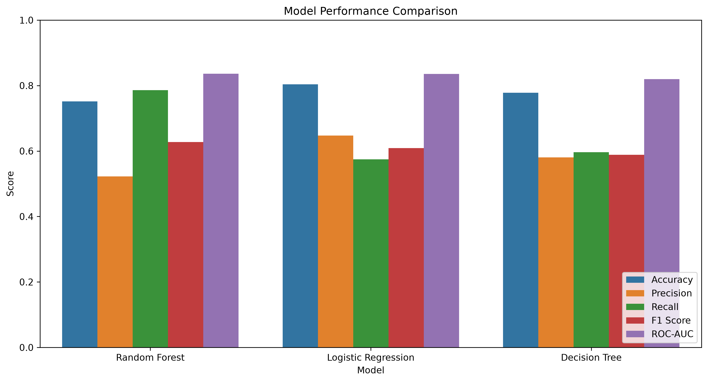
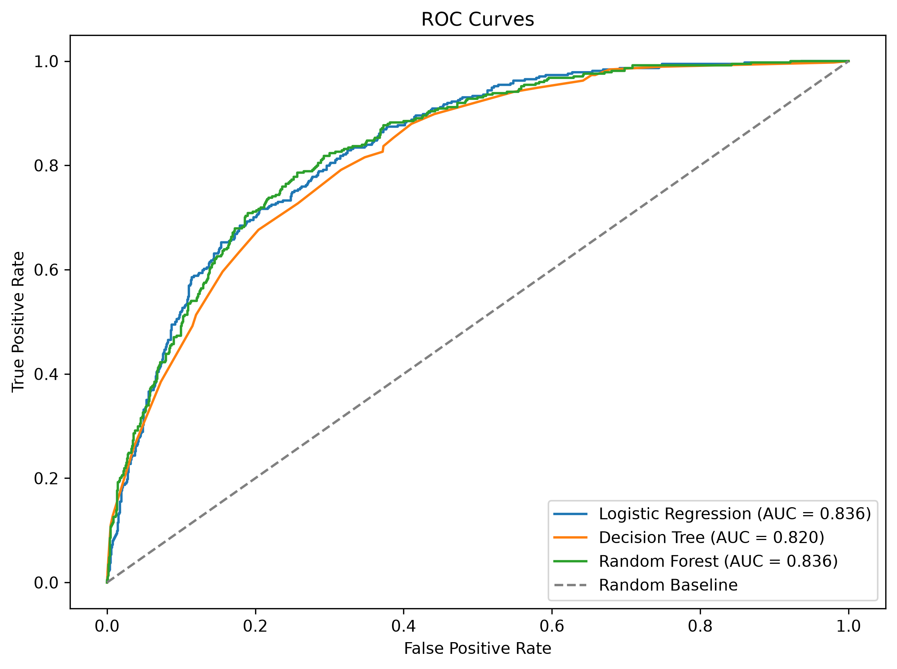
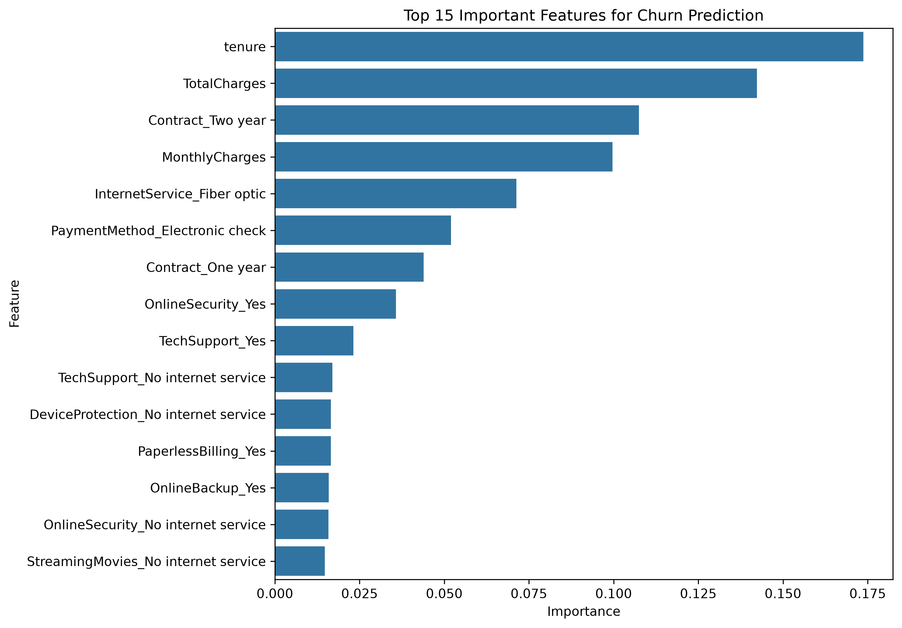
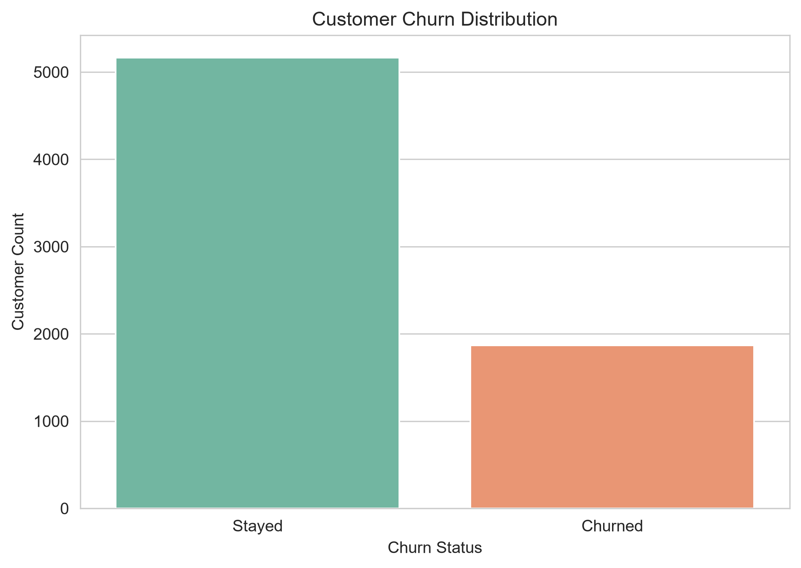
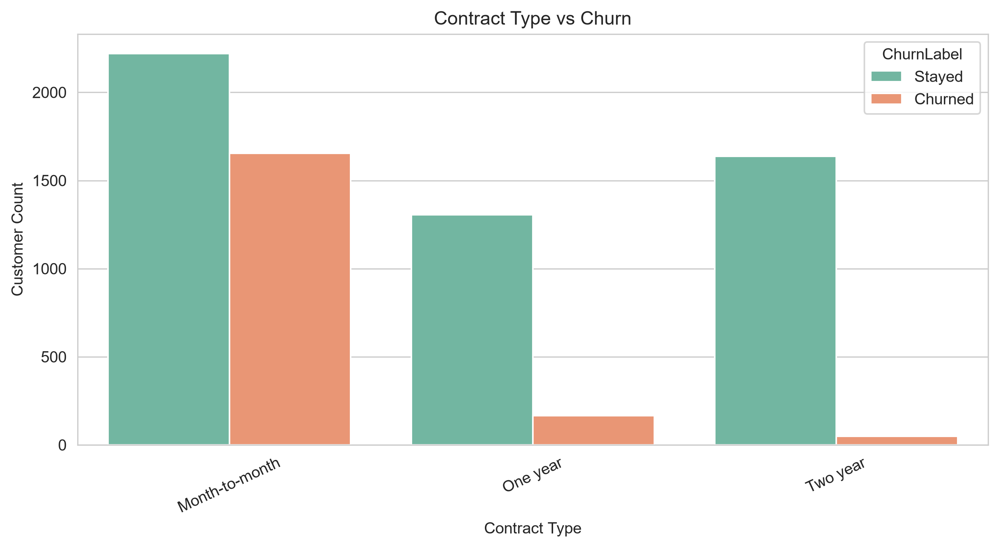
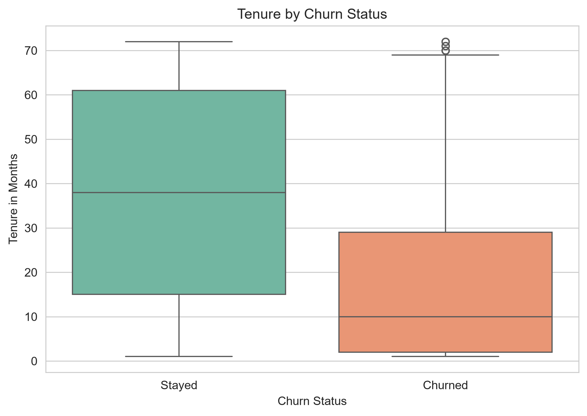
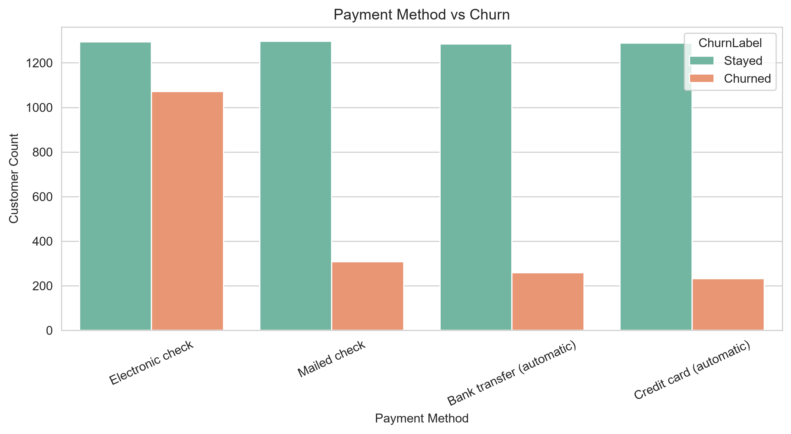

# Telco Customer Churn Prediction

End-to-end customer churn analytics project combining Python, machine learning, Power BI, and a live Streamlit prediction app. The project analyzes telecom customer behavior, identifies churn drivers, predicts high-risk customers, and presents insights through an executive dashboard.

🌐 **Live Streamlit App:** [Launch App](https://telco-churn-prediction-model.streamlit.app/)


## Project Objective

The goal of this project is to answer a core business question:

> Why are customers leaving, and which customers are most likely to churn next?

The solution covers the full analytics lifecycle:

- Data understanding and cleaning
- Exploratory data analysis
- Machine learning churn prediction
- Customer-level churn probability scoring
- Power BI dashboard reporting
- Live customer churn prediction app

## Dashboard Preview

### Customer Health Overview


### Churn Intelligence


### Predictive Analysis


## Key Business Findings

- Overall churn rate is approximately **26.6%**.
- Month-to-month contract customers show the highest churn risk.
- Customers with shorter tenure are more likely to leave.
- Fiber optic customers show elevated churn compared with DSL customers.
- Electronic check users are strongly associated with higher churn.
- Customers without Tech Support or Online Security churn more frequently.
- Senior citizens have a higher churn rate than non-senior customers.
- Predictive scoring enables retention teams to prioritize high-risk customers.

## Machine Learning Summary

Three supervised classification models were trained and compared:

- Logistic Regression
- Decision Tree
- Random Forest

The final selected model is:

| Metric | Value |
|---|---:|
| Best Model | Random Forest |
| Accuracy | 75.20% |
| Precision | 52.22% |
| Recall | 78.61% |
| F1 Score | 62.75% |
| ROC-AUC | 83.60% |
| Cross Validation Mean ROC-AUC | 84.40% |
| Cross Validation Std | 1.29% |
| Deployment Threshold | 59.05% |
| Features Used | 30 |

The prediction output is saved in:

```text
Datasets/Telco_Customer_Predictions.csv
```

It includes all original customer fields plus:

- `Predicted_Churn`
- `Churn_Probability`

## Model Evaluation Visuals

### Model Comparison



### ROC Curves



### Feature Importance



## Exploratory Data Analysis Visuals

### Churn Distribution



### Contract Type vs Churn



### Tenure vs Churn



### Payment Method vs Churn



## Project Workflow

```text
Raw Dataset
    |
    v
Data Understanding
    |
    v
Data Cleaning
    |
    v
Exploratory Data Analysis
    |
    v
Feature Encoding and Train-Test Split
    |
    v
Model Training and Evaluation
    |
    v
Best Model Selection
    |
    v
Customer Churn Probability Scoring
    |
    v
Power BI Dashboard and Live Streamlit App
```

## Repository Structure

```text
Customer Churn Prediction/
|
|-- Datasets/
|   |-- Telco-Customer-Churn.csv
|   |-- Telco-Customer-Churn-Cleaned.csv
|   |-- Telco_Customer_Predictions.csv
|   |-- model_comparison.csv
|   |-- cross_validation_results.csv
|
|-- Documentation/
|   |-- Documentation.txt
|   |-- Customer Churn Intelligence report.pdf
|
|-- Images/
|   |-- EDA charts
|   |-- Model evaluation charts
|
|-- Models/
|   |-- best_model.pkl
|   |-- random_forest.pkl
|   |-- logistic_regression.pkl
|   |-- decision_tree.pkl
|   |-- scaler.pkl
|   |-- feature_names.pkl
|   |-- model_info.txt
|   |-- threshold_analysis.txt
|
|-- Power BI/
|   |-- Telco_Churn_Prediction.pbix
|   |-- Telco_Churn_Prediction.pdf
|   |-- Aurora_Predictive.json
|
|-- LIVE/
|   |-- app.py
|   |-- requirements.txt
|
|-- Python/
|   |-- Phase_1_Data_Understanding.py
|   |-- Phase_2_Data_Cleaning.py
|   |-- Phase_3_Python_EDA.py
|   |-- Phase_5_ML_Models.py
|   |-- Requirements.txt
|
|-- Dashboard Screenshot/
|   |-- Telco_Churn_Prediction-1.png
|   |-- Telco_Churn_Prediction-2.png
|   |-- Telco_Churn_Prediction-3.png
|
|-- README.md
|-- LICENCE
```

## Technologies Used

- Python
- Pandas
- NumPy
- Matplotlib
- Seaborn
- Scikit-learn
- Joblib
- Streamlit
- Plotly
- Power BI

## How To Run The Python Pipeline

Install dependencies:

```bash
pip install -r Python/Requirements.txt
```

Run data cleaning:

```bash
python Python/Phase_2_Data_Cleaning.py
```

Run EDA:

```bash
python Python/Phase_3_Python_EDA.py
```

Run machine learning pipeline:

```bash
python Python/Phase_5_ML_Models.py
```

## How To Run The Live App

Install app dependencies:

```bash
pip install -r LIVE/requirements.txt
```

Start the Streamlit app:

```bash
streamlit run LIVE/app.py
```

The app allows users to input customer details and receive:

- Churn prediction
- Churn probability
- Risk category
- Business-facing interpretation

## Power BI Dashboard

The Power BI dashboard is available in:

```text
Power BI/Telco_Churn_Prediction.pbix
Power BI/Telco_Churn_Prediction.pdf
```

Dashboard pages:

- Customer Health Overview
- Churn Intelligence
- Predictive Analysis

## Dataset

Dataset used:

```text
IBM Telco Customer Churn Dataset
```

The dataset contains customer demographics, service subscriptions, contract details, billing information, and churn status.

## Business Value

This project helps a telecom company:

- Identify customers likely to churn.
- Understand churn-driving customer segments.
- Prioritize retention campaigns.
- Monitor churn risk through Power BI.
- Use live prediction for individual customer assessment.
- Connect machine learning outputs with business decision-making.

## Author

**Arun Sharma**

Data Analyst | Machine Learning Enthusiast

## License

This project is licensed under the terms included in [LICENCE](LICENCE).
